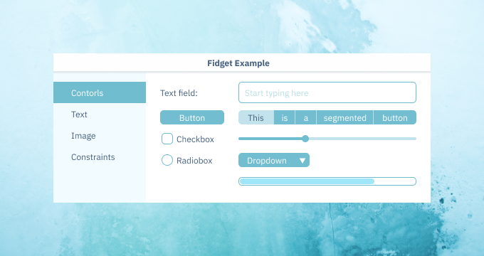
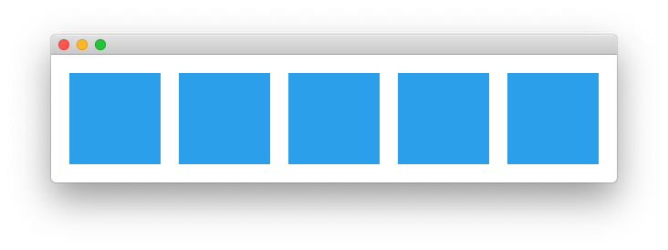

👏 👏 👏 Check out video about the library: [Fidget: Let's rethink UI development with Nim (NimConf 2020)](https://www.youtube.com/watch?v=IB8Yt2dqZbo) 👏 👏 👏


# Fidget - A cross platform UI library for nim

⚠️ WARNING: This library is still in heavy development. ⚠️

Fidget aims to provide performant natively compiled cross platform UIs for any platform - Web with HTML5, Windows, macOS, Linux, iOS and Android with OpenGL.

Fidget leverages [Figma](https://www.figma.com/) - an app that is taking the design world by storm. It does this by providing a [Figma Plugin](figma_plugin/code.ts) to export directly to fidget code! No more counting stupid pixels, no more CSS puzzles. Want to change some spaces? Change it in Figma and export.

Fidget uses plain nim-procs, nim-templates, if-statements and for-loops. As well as providing only minimal primitives found in [Figma](https://www.figma.com/).

## Example:

<p align="center">
  <br>
  
</p>
<p align="center" style='font-size:12px'>
  <a href="http://kate.vonhouck.com/">Design done by Kate von Houck. Available for hire.</a>
</p>

See code here: [examples/demo/demo.nim](examples/demo/demo.nim)

## Minimal Sample:

```nim
import fidget, vmath

proc drawMain() =
  frame "main":
    box 0, 0, 620, 140
    for i in 0 .. 4:
      group "block":
        box 20+i*120, 20, 100, 100
        fill "#2B9FEA"

windowFrame = vec2(620, 140)
startFidget(drawMain)
```

<p align="center">
  <br>
  
</p>

See code here: [examples/minimal/minimal.nim](examples/minimal/minimal.nim)


# Backends

Fidget has several backends that are planned:
* HTML (best supported)
* Windows (next best support)
* Mac (less support)
* Linux (less support)
* iOS (proof of concept only)
* Android (proof of concept only)

# Philosophy - Minimalism

* Mimic how [Figma](https://www.figma.com/) (Amazing UI/UX app) does it.
* Everything is a Node.
* There are Group, Rectangle, Image and Text Nodes.
* Nodes are positions relative to the parent
* Nodes have minimal set of properties that match Figma.
* Resizing is done same way as Fimga's [Constraints](https://www.youtube.com/watch?v=rRQAQ1d9q9w).
* Layout is done same way as Figma's [Auto Layout](https://www.youtube.com/watch?v=NrKX46DzkGQ).

The main idea of fidget is to use standard imperative nim paradigms like nim-procs, nim-for-loops, nim-ifs, nim-templates instead of say providing a custom language, XML templates, HTML, Jinja templates, CSS ...

Instead of creating CSS classes you just create a nim proc or a nim template with the things you want and reuse that. Instead of having some sort of list controller you just use a for loop to position your list elements.

There are very little UI layout primitives just align left, center, right, both, or scale for the X axis and top, center, bottom, both, or scale for the Y axis. There is none of margin, padding, float, absolute, relative, border box, flex, recycle view controllers, stack layout, constraints ...

If you want to do something fancy just do a little math. Many times a simple math formula is smaller, simpler, and easier to figure out then layout puzzles.

# Why Nim?

Nim is a great languages because it’s easy on the eyes like Python, but typed and is performant as C. It can also compile to JavaScript, C, C++, ObjC. Nim is a great language for UI design because it has advanced templates and macros can make a really good DSL (domain specific language) - that makes writing UIs straightforward, intuitive and crossplatform.

# Imperative UI Style

I like imperative style of programming. This is a style you probably learned to program at the start, but was forced to abandon with more complex and ill fitting object oriented style. Imperative style to me means when you are only using functions, if-statements and for-loops. Imperative style to me means simple data structures of structs, lists and tables. Simple functions that read from top to bottom with as few branches as possible.

Each UI frame is drawn completely from start to finish all in the code you control. Use of callbacks is discouraged. Think liner, think simple. After any event by the user, data or timer, the UI is redrawn. The UI is redrawn in an efficient way as to allow this. With HTML a modification cache is used to ensure only a minimal amount of DOM changes are needed. With OpenGL you redraw the whole screen using as few state transitions and batching everything into a texture atlas and single global vertex buffer.


## How to run the examples:


```sh
git clone https://github.com/treeform/fidget
cd fidget
nimble install
cd examples/minimal
nim c -r minimal
```

### Native examples for Windows, macOS, and Linux:

First `cd` to each folder then compile and run.

```sh
nim c -r bars.nim
nim c -r hovers.nim
nim c -r inputs.nim
nim c -r padoftext.nim
nim c -r padofcode.nim
nim c -r basic.nim
```

### Runs the same examples as HTML:

First `cd` to each folder then run `js` compile command then open the `.html` file in a browser.

```sh
nim js bars.nim
nim js hovers.nim
nim js inputs.nim
nim js padoftext.nim
nim js padofcode.nim
nim js basic.nim
```

## Run all tests and save a screenshot

```sh
nim c -r tests/run --compile --native --testOneFrame
```

## Figma Plug

To compile the figma plug run TypeScript in the figma_plugin folder.

```sh
tsc
```

Then go to figma and add a development plugin from this folder.
