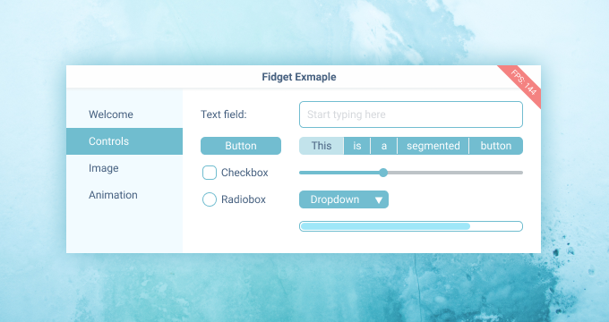

# Fidget - UI library for nim

It is an absolute travesty that there is no good and easy way to design cross platform UIs. The HTML5 + electron + mobile webviews is the only reasonable way to do it, but it sux. HTML/CSS is just so complex and confusing, and JS can be really slow!

It is also an absolute travesty that programmers have to code UIs by hand from flat design mockups. Fidget leverages the Figma - an app that is taking design world by storm. It does this by taking Figma files and converting them to code. No more counting stupid pixels. Want to change some spaces? Change it Figma and reload.

HTML5 has a ton of layout primitives, margin, padding, float, absolute, relative, border box, flex and friends. I want to simplify this to just the most basic way to lay something out. Because Fidget leverages Figma, I am adopting their system, because it simple and visual:

* Everything is a Group.
* Groups are positions relative to the parent
* Groups have width and height.
* Resizing with left, top, right, bottom, scale or center.

  

Figma also has a concept of Symbol, which is basically a function call for UI work. Most of the time you will be calling these symbols to draw UI.

Fidget has several backends that are planned:
* HTML
* Mac
* Linux
* Windows
* iOS (not started yet)
* Android (not started yet)

But currently only HTML is being worked on.

# Why Nim?

Nim is a great languages because it’s like python, is typed and is perfromant as C. It can also compile to JavaScript, C, C++, ObjC. It has advanced template and macro system which allows UI code to look very nice and simple.

# Imperative UI Style

I like imperative style of programing. This is a style you probably learned to program at start, but was forced to abandon with more complex and ill fitting object oriented style. Imperative style to me means when you are only using functions, if statements and for loops. I am also not a huge fan of functional programming such currying, foldr, recursion, or immutable everywhere. Imperative style to me means simple data structures of structs, lists and tables. Simple functions that read from top to bottom with as little branches as possible.

Each UI frame is drawn completely from start to finish all in the code you control. Use of callbacks is discouraged. Think liner, think simple. After any event by the user, data or timer, the UI is redrawn. The UI is redrawn in an efficient way as to allow this.

